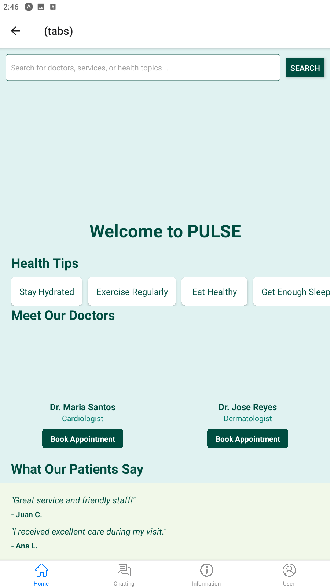
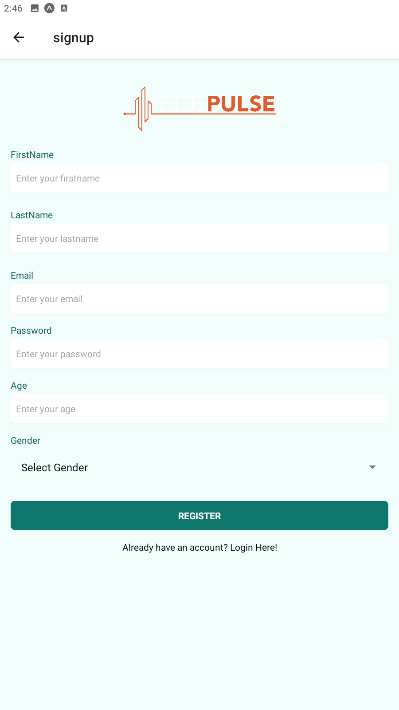
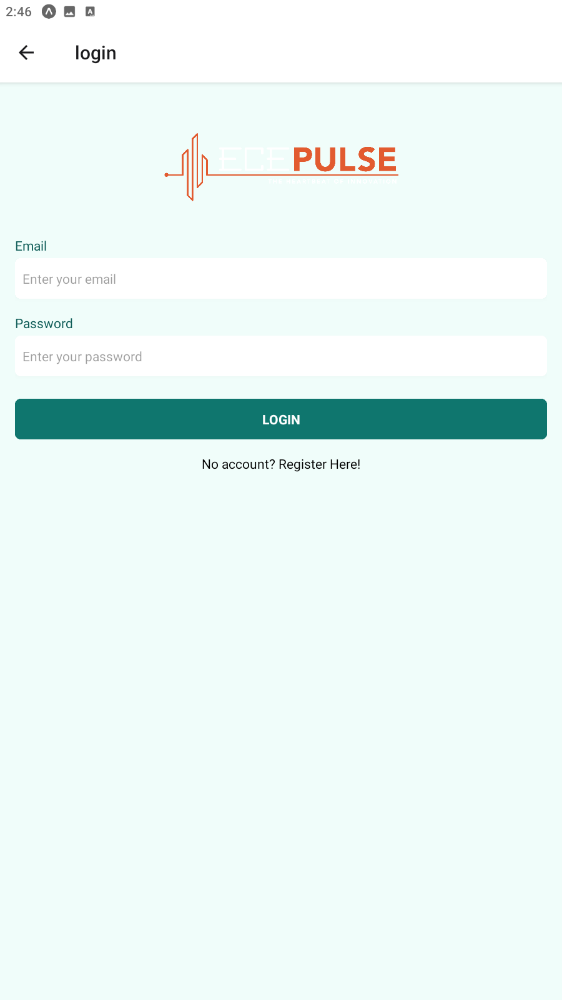
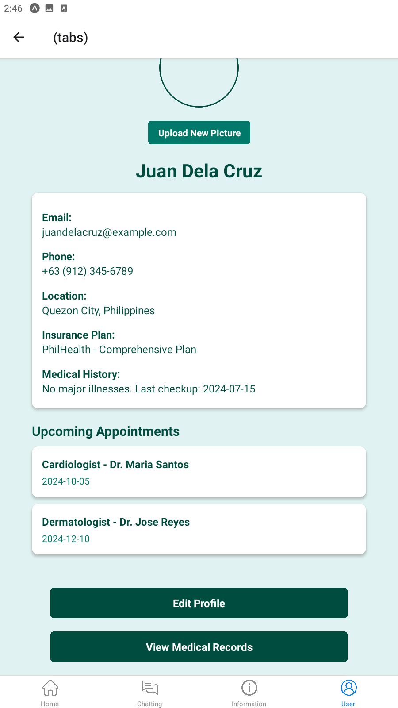

# Pulse
Pulse!

# Features
* Monitor Patients
* Gather Data on Various Health Diseases
* Provide a Good Source of Direct Contact in the Hospital
* Develop Further Research in Diseases

# Course Overview
* Basic React Native Components
* Database Design using Appwrite
* User Registration & Authenticaiton
* Deployment

# Tech Stack
* React Native
* AppWrite
* HTML, CSS and JS

# Home Screen
  

# Sign up Screen
  

# Sign in Screen
  

# Profile
  

# Tab Screen
